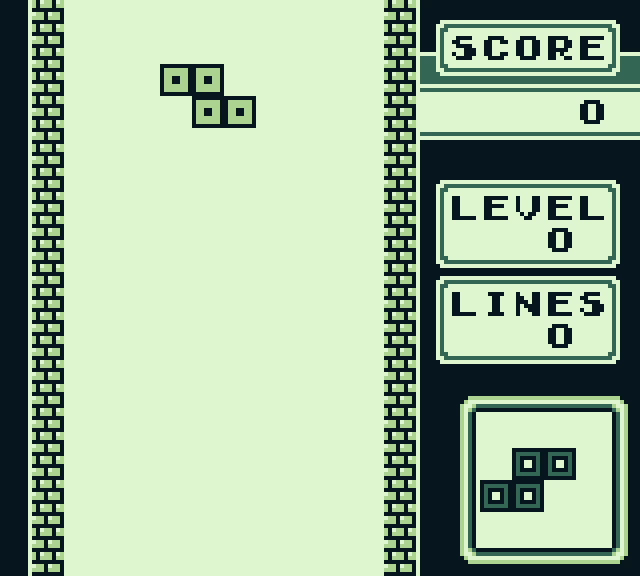

# GBC3

A Gameboy emulator written in [C3](https://c3-lang.org/) to both learn the language and have fun making an emulator for the first games console I owned.

Missing features:

- Audio
- MBC2+ Cartridges
- Saving

Along with a lot of glitches that need fixing